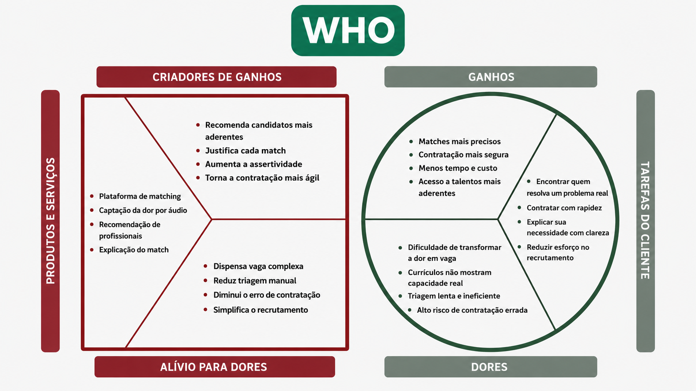
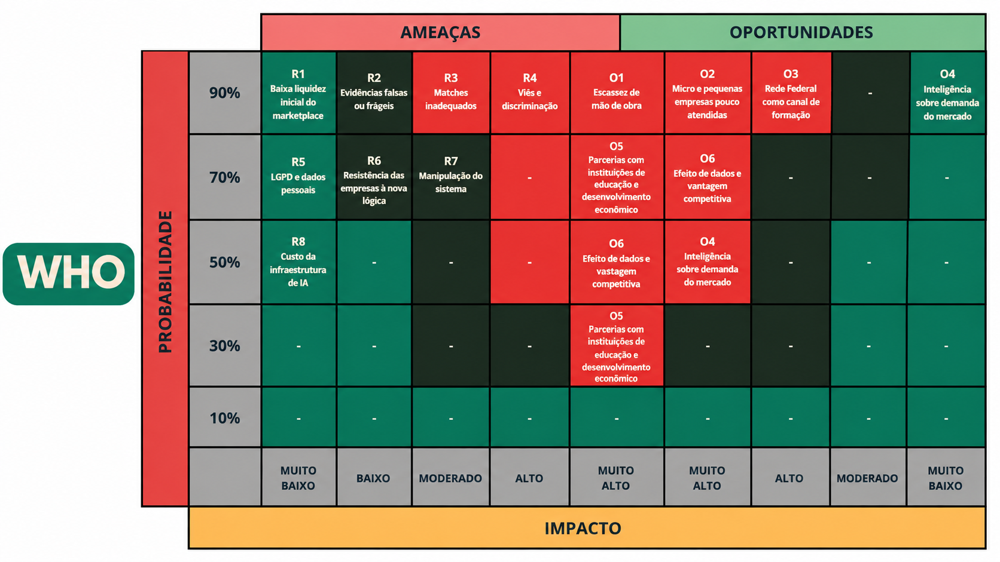
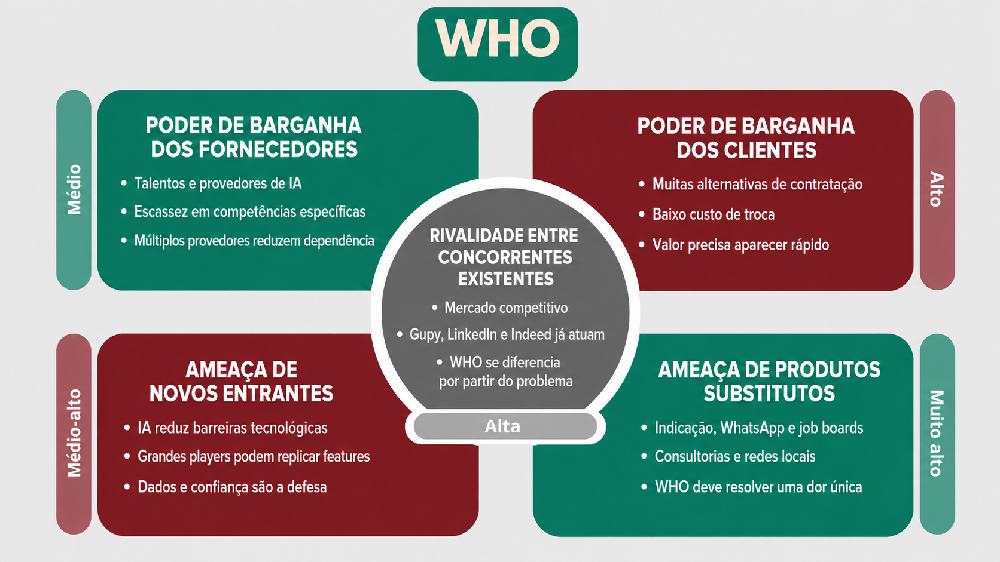

# Documentação da Solução — WHO  — Hack2 - 1ª Edição

## Integrantes do time
- Igor da Silva Rodrigues (https://www.linkedin.com/in/igor-dasilva-rodrigues/?skipRedirect=true)
- José Isáias Menezes (https://www.linkedin.com/in/joseisaias/?skipRedirect=true)
- Julia Amanda Gregate de Araújo (https://www.linkedin.com/in/julia-amanda-gregate-de-araujo/)


## Sumário

1. [1. Visão Geral](#1-visão-geral)
   * 1.1. [Problemática](#11-problemática)
     * 1.1.1. [Evidências e validação inicial](#111-evidências-e-validação-inicial)
     * 1.1.2. [Hipóteses e critérios de validação](#112-hipóteses-e-critérios-de-validação)
   * 1.2. [Solução Proposta](#12-solução-proposta)
     * 1.2.1. [Como funciona na prática](#121-como-funciona-na-prática)
     * 1.2.2. [Arquitetura-alvo e justificativa técnica](#122-arquitetura-alvo-e-justificativa-técnica)
     * 1.2.3. [Experiência do usuário e estado atual do MVP](#123-experiência-do-usuário-e-estado-atual-do-mvp)
     * 1.2.4. [Salvaguardas de projeto](#124-salvaguardas-de-projeto)
     * 1.2.5. [Modelo de monetização](#125-modelo-de-monetização)
   * 1.3. [Value Proposition Canvas](#13-value-proposition-canvas)
2. [2. Análises de Mercado](#2-análises-de-mercado)
   * 2.1. [Matriz de Riscos](#21-matriz-de-riscos)
   * 2.2. [Matriz de Oportunidades](#22-matriz-de-oportunidades)
   * 2.3. [Conexão entre Riscos e Oportunidades](#23-conexão-entre-riscos-e-oportunidades)
   * 2.4. [Prioridades de Gestão para o MVP](#24-prioridades-de-gestão-para-o-mvp)
   * 2.5. [Critérios de Reavaliação](#25-critérios-de-reavaliação)
   * 2.6. [Modelo de 5 Forças de Porter](#26-modelo-de-5-forças-de-porter)
   * 2.7. [Estratégias de Inserção no Mercado (Go-to-Market)](#27-estratégias-de-inserção-no-mercado-go-to-market)
   * 2.8. [Benchmark e Posicionamento Competitivo](#28-benchmark-e-posicionamento-competitivo)
   * 2.9. [Análise de Retorno sobre Investimento (ROI Y1)](#29-análise-de-retorno-sobre-investimento-roi-y1)
3. [3. Produto](#3-produto)
   * 3.1. [Personas](#31-personas)
   * 3.2. [Interface e Front-end (UX)](#32-interface-e-front-end)
4. [4. Arquitetura Técnica](#4-arquitetura-técnica)
   * 4.1. [Visão Geral da Arquitetura](#41-visão-geral-da-arquitetura)
   * 4.2. [Stack Tecnológico](#42-stack-tecnológico)
   * 4.3. [Lógica dos Componentes Centrais](#43-lógica-dos-componentes-centrais)
   * 4.4. [Limitações do MVP e Escopo](#44-limitações-do-mvp-e-escopo)
   * 4.5. [Fluxo de Integração e Dados](#45-fluxo-de-integração--pagamento--dados)
5. [5. Conclusão](#5-conclusão)
6. [6. Cronograma de Desenvolvimento (Roadmap)](#6-cronograma-de-desenvolvimento-roadmap)
7. [7. Referências](#7-referências)

---

# 1. Visão Geral

## 1.1. Problemática

Em Lagarto, no centro-sul de Sergipe, a equipe observou uma aparente contradição: empresas relatam dificuldade para contratar, enquanto jovens com formação técnica relatam falta de oportunidades locais. A hipótese central do WHO é que parte desse desencontro não decorre apenas da quantidade de vagas ou de profissionais, mas de uma **falha de tradução entre necessidade e competência**.

O mercado de trabalho brasileiro encerrou 2025 aquecido: a taxa de desocupação do país chegou a 5,1% no quarto trimestre, a menor da série histórica iniciada em 2012 (IBGE, 2026). Ao mesmo tempo, 62,3% das empresas consultadas pelas Sondagens Empresariais do FGV IBRE declararam dificuldade para contratar ou reter pessoas no fim de 2025 (FGV IBRE, 2026). Esses indicadores não provam, isoladamente, a hipótese do WHO; eles mostram que baixa desocupação e dificuldade de contratação podem coexistir e justificam investigar mecanismos de conexão mais eficientes.

Essa investigação ganha relevância diante da expansão da educação profissional. O Censo Escolar 2025 registrou 3.187.976 matrículas na educação profissional — crescimento de 68,4% em relação a 2021 — e mostrou que as matrículas em cursos técnicos articulados já correspondem a 20,1% das matrículas do ensino médio regular na rede pública (INEP, 2026). Formar mais técnicos, porém, não garante sua inserção produtiva no território.

Em estudo com 122 egressos do Ifes Campus Guarapari, Carvalho Junior e Coelho Junior (2022) identificaram baixa inserção no mercado de trabalho local e baixa atuação na área de formação. O estudo não representa todos os Institutos Federais nem comprova a realidade de Lagarto, mas oferece evidência acadêmica convergente para um fenômeno observado em outro município de porte regional.

Do lado do egresso, projetos escolares, estágios, trabalhos informais e iniciativas próprias podem demonstrar competência, mas nem sempre aparecem com força em um currículo organizado por cargos e vínculos anteriores. A exigência de experiência prévia agrava essa barreira; o próprio artigo 442-A da CLT limita a exigência de comprovação a seis meses no mesmo tipo de atividade (BRASIL, 2008).

Do lado da empresa, especialmente quando não há equipe dedicada de Recursos Humanos, é mais fácil relatar um sintoma operacional — “o estoque não fecha”, “a entrega atrasa”, “a máquina parou” — do que convertê-lo em cargo, competências, senioridade e critérios de seleção. O resultado é uma dupla perda de informação: a empresa não estrutura com precisão o que precisa e o egresso não estrutura com precisão o que sabe fazer.

**Problema de projeto:** como transformar relatos espontâneos de problemas empresariais e demonstrações práticas de profissionais em representações comparáveis, sem exigir uma vaga formal da empresa nem experiência empregatícia prévia do candidato?

### 1.1.1. Evidências e validação inicial

| Evidência | Resultado observado | O que sustenta | Limite da evidência |
|---|---|---|---|
| PNAD Contínua, 4º trimestre de 2025 | Desocupação nacional de 5,1% (IBGE, 2026) | Contexto de mercado aquecido | Não mede egressos técnicos nem Lagarto isoladamente |
| Sondagens Empresariais, fim de 2025 | 62,3% das empresas relataram dificuldade para contratar ou reter (FGV IBRE, 2026) | Dor empresarial ampla | Não identifica sozinho a causa da dificuldade |
| Estudo com 122 egressos do Ifes Guarapari | Baixa inserção local e baixa atuação na área de formação (CARVALHO JUNIOR; COELHO JUNIOR, 2022) | Problema convergente em contexto semelhante | Estudo de caso de outro campus e outra região |
| Consulta exploratória da equipe | 5 de 10 empresas consultadas não detalharam o perfil necessário além da dor operacional | Sinal local de dificuldade de tradução | Sem registro completo de roteiro, período e perfil da amostra; não permite generalização |

O último resultado é tratado como **sinal exploratório**, não como estimativa estatística. Antes de uma conclusão sobre o mercado de Lagarto, o projeto deverá registrar o instrumento de pesquisa, o critério de seleção dos participantes, consentimento, transcrições anonimizadas e análise temática. Essa delimitação evita apresentar percepção inicial como fato consolidado.

### 1.1.2. Hipóteses e critérios de validação

| Hipótese testável | Experimento proposto | Critério de sucesso do piloto |
|---|---|---|
| H1 — A empresa consegue descrever melhor uma dor falando livremente do que preenchendo uma vaga tradicional | Teste comparativo com as mesmas empresas, usando áudio guiado e formulário | Pelo menos 80% confirmam o *Problem Map* sem correções críticas; tempo mediano de entrada inferior a 5 minutos |
| H2 — Evidências práticas revelam competências que não aparecem no currículo | Avaliação cega de currículo versus Professional Map por especialistas | Média de competências relevantes pelo menos 20% maior, com concordância entre avaliadores |
| H3 — O pareamento estruturado melhora a relevância do topo do ranking | Comparar busca lexical e pipeline WHO no mesmo conjunto rotulado | Ganho mínimo de 15 pontos percentuais em Precision@5, sem perda nos critérios obrigatórios |
| H4 — A experiência é utilizável pelos dois públicos | Teste moderado com empresas e egressos | Taxa de conclusão ≥ 85%, SUS ≥ 75 e nenhum erro crítico de compreensão |

Os valores acima são **metas de validação**, não resultados já alcançados. Para o protocolo, considera-se crítica a correção que altera objetivo, área, competência obrigatória ou restrição do mapa; uma competência só é considerada relevante quando confirmada por pelo menos dois avaliadores independentes. Eles tornam a proposta falseável e definem o que precisa ser demonstrado para que o projeto avance do protótipo para um piloto real.

## 1.2. Solução Proposta

O WHO é uma plataforma de intermediação orientada por problemas e evidências. Em vez de começar por uma vaga e procurar palavras semelhantes em currículos, recebe uma **dor operacional** da empresa e procura **evidências de competências aplicáveis** apresentadas pelos profissionais.

A proposta de valor pode ser resumida em uma frase: **a empresa conta o problema do seu jeito; o profissional mostra o que sabe fazer; o WHO organiza, compara e explica a conexão entre os dois.**

O sistema estrutura a entrada empresarial em um **Problem Map** e a entrada profissional em um **Professional Map**. O primeiro descreve contexto, resultado esperado, competências implicadas, restrições e urgência. O segundo registra competência demonstrada, evidência associada, contexto de execução e grau de comprovação. O pareamento ocorre entre esses mapas, mantendo os relatos originais disponíveis para revisão humana.

### 1.2.1. Como funciona na prática

O sistema foi concebido em dois fluxos assimétricos que convergem para o mesmo mecanismo de pareamento. Em ambos, a interpretação gerada precisa ser revisada pelo usuário antes de produzir recomendações.

**Fluxo A — captura da dor (empresa).** O empresário grava um áudio ou escreve livremente sobre o problema. Após a transcrição automática (ASR), um extrator baseado em LLM propõe um objeto validado por schema: natureza do problema, área afetada, resultado esperado, competências implicadas, autonomia, contexto, urgência e restrições. Perguntas de aprofundamento tratam lacunas críticas; a confirmação da empresa gera o **Problem Map**.

**Fluxo B — captura da evidência (profissional).** O profissional grava ou anexa uma demonstração e descreve o contexto do trabalho. O extrator identifica competências, evidências associadas, domínio, condições de execução e grau de comprovação. Após revisão do profissional, o resultado forma o **Professional Map**.

**Normalização.** Os mapas são associados a um vocabulário comum de competências. A CBO funciona como referência ocupacional inicial, não como ontologia completa de habilidades; por isso, o vocabulário deverá ser complementado e validado com especialistas de cada domínio técnico.

**Vetorização e indexação.** Na arquitetura-alvo, cada mapa canonicalizado é convertido em embedding multilíngue. A indexação HNSW será adotada somente se volume e testes de latência justificarem essa complexidade; no piloto, busca exata pode funcionar como baseline mais simples e auditável.

**Pareamento.** A arquitetura-alvo combina recuperação densa por embeddings e recuperação lexical por BM25, com fusão RRF e reranking. Cada componente será mantido apenas se superar baselines mais simples nas métricas definidas na seção 1.1.2; nesta fase, trata-se de uma hipótese de engenharia, não de precisão já demonstrada.

**Explicabilidade.** Para cada perfil recomendado, a saída relaciona evidências específicas do profissional a critérios confirmados no Problem Map e também apresenta lacunas ou pontos de atenção. O score não substitui a decisão humana nem representa uma avaliação absoluta da pessoa.

```
EMPRESA                                    PROFISSIONAL
   ↓ áudio (dor)                              ↓ vídeo (evidência)
[ASR — transcrição]                        [ASR — transcrição]
   ↓                                          ↓
[Agente extrator LLM]                      [Agente extrator LLM]
   ↓                                          ↓
PROBLEM MAP (JSON)                         PROFESSIONAL MAP (JSON)
   ↓                                          ↓
[Canonicalização — taxonomia CBO]  ←──→  [Canonicalização — taxonomia CBO]
   ↓                                          ↓
[Embedding]                                [Embedding + indexação HNSW]
   ↓                                          ↓
   └──────────→ MATCHING ENGINE ←─────────────┘
                 busca híbrida (denso + BM25)
                 fusão RRF → reranking cross-encoder
                          ↓
              RANKING + EXPLICAÇÃO DO MATCH
```

### 1.2.2. Arquitetura-alvo e justificativa técnica

Uma arquitetura semântica é candidata adequada porque a entrada é livre e os dois lados descrevem o mesmo contexto por perspectivas diferentes. Ainda assim, sua necessidade será validada por comparação com busca lexical e regras determinísticas.

**A entrada começa não estruturada.** Áudio e texto livre reduzem o esforço inicial de quem ainda não sabe nomear cargo ou competência. Eles não são os únicos canais: texto, anexos e edição manual permanecem disponíveis por acessibilidade, privacidade e conectividade.

**As duas pontas usam registros diferentes.** Um enunciado de dor ("o estoque some e ninguém sabe explicar") descreve um sintoma; uma evidência ("reorganizei o controle de peças de uma oficina") descreve uma ação. A hipótese técnica é que mapas estruturados sobre um vocabulário comum representem melhor essa relação do que a comparação direta das transcrições. A extração intermediária é a contribuição central a validar; a busca vetorial, isoladamente, não resolve o problema.

**Busca lexical isolada pode perder equivalências.** Correspondência por palavras-chave depende de vocabulário compartilhado. Recuperação densa pode ampliar o *recall*, mas também pode introduzir falsos positivos; por isso o desenho combina termos obrigatórios, similaridade semântica, reranking e revisão humana.

### 1.2.3. Experiência do usuário e estado atual do MVP

Nenhum dos dois usuários precisa interagir com a complexidade técnica descrita acima.

**Para a empresa**, a experiência proposta é descrever a situação, revisar a interpretação, responder a poucas perguntas críticas e comparar uma lista curta de perfis com justificativas e pontos de atenção. Não é obrigatório começar por um cargo, mas a empresa continua responsável por confirmar critérios e condições da oportunidade.

**Para o profissional**, a experiência proposta é registrar uma demonstração, revisar as competências extraídas e receber oportunidades relacionadas. Projetos escolares, estágios, trabalhos informais e iniciativas próprias são aceitos, desde que apresentados com seu nível real de comprovação.

> **Estado do MVP em agosto de 2026:** o repositório contém um protótipo navegável em React e TypeScript. Áudio, vídeo, processamento por IA, autenticação e dados são simulados no frontend; ainda não há backend nem modelo de matching integrado. As telas permitem validar jornada e usabilidade, mas não comprovam precisão algorítmica, segurança ou desempenho em produção.

### 1.2.4. Salvaguardas de projeto

Quatro riscos orientam o desenho e os testes do produto:

**Veracidade.** Um relato articulado não comprova sozinho uma competência. Cada item do Professional Map deverá indicar a natureza da evidência — demonstração observável, relato circunstanciado, documento ou autodeclaração — sem confundir fluência de comunicação com proficiência técnica.

**Viés e acessibilidade.** Aparência, voz, sotaque e qualidade do equipamento não devem compor o ranking. A primeira avaliação será anonimizada e baseada em transcrição, mapa e trechos técnicos. Texto deverá permanecer como alternativa ao áudio, e anexos como alternativa ao vídeo, para não excluir usuários com deficiência, conexão limitada ou desconforto com câmera.

**Proteção de dados.** Áudio, vídeo, transcrição e inferências de perfil são dados pessoais sob a Lei nº 13.709/2018 (LGPD). Um piloto real dependerá de base legal documentada, aviso de privacidade, retenção mínima, controle de acesso, registro de compartilhamento e canal para revisão das inferências.

**Automação responsável.** O WHO não deverá eliminar candidatos automaticamente. O usuário precisa revisar mapas gerados, conhecer os critérios do ranking, contestar erros e compreender que o score representa aderência à demanda informada — não uma nota absoluta sobre a pessoa.

### 1.2.5. Modelo de monetização

O WHO adota modelo **freemium**: a funcionalidade central — captura da dor, captura da evidência, pareamento e explicação do match — é gratuita para ambos os lados. A cobrança incide exclusivamente sobre **serviços premium**, adquiridos por opção do usuário e situados fora do fluxo de intermediação.

Essa escolha responde a duas restrições. A primeira é econômica: cobrar pela função central pode excluir exatamente o profissional sem vínculo e a pequena empresa sem estrutura de RH. A segunda é de liquidez: uma plataforma de dois lados só entrega valor quando existe densidade suficiente de participantes relevantes no mesmo território e domínio.

**Princípio de projeto:** nenhum serviço premium altera o algoritmo de pareamento. Pagamento não confere prioridade, destaque nem reposicionamento. Esse isolamento deverá ser verificável por regras de produto, arquitetura e auditoria.

Essa delimitação é uma premissa de negócio, não um parecer jurídico. Antes de comercialização, preços, termos de uso e serviços cobrados deverão passar por análise jurídica específica, incluindo legislação trabalhista, consumerista e de proteção de dados.

Os serviços premium previstos organizam-se em duas frentes:

**Inteligência de mercado para o profissional.** Com base em dados agregados e respeitando finalidade, minimização e anonimização, o sistema poderá apresentar competências demandadas por área e território e lacunas entre o perfil do profissional e a demanda observada. Esse recurso **não interfere na posição do profissional nos resultados de busca**.

**Ferramental de gestão para a empresa.** Funcionalidades voltadas a organizações com volume recorrente de contratação: histórico e comparação de processos, gestão de múltiplos Problem Maps, acompanhamento, exportação e integrações. São recursos de produtividade, não mecanismos de vantagem no ranking.

Precificação, taxa de conversão e disposição a pagar ainda são hipóteses e deverão ser testadas depois da validação do problema e do mecanismo de match. A modelagem financeira é apresentada na seção 2.9.

## 1.3. Value Proposition Canvas

Como o WHO é uma plataforma de dois lados, há um perfil de cliente e um mapa de valor para cada público. A figura explicita não apenas dores e ganhos, mas o encaixe entre cada necessidade e a resposta proposta.

<div align="center">
<p>Figura 1 – Canvas de proposta de valor.</p>



<p>Fonte: próprios autores, 2026.</p>
</div>

### Encaixe problema–solução

| Público | Dor prioritária | Resposta do WHO | Evidência de valor no piloto |
|---|---|---|---|
| Empresa | Não consegue transformar o problema em critérios claros | Entrada livre + Problem Map revisável | Percentual de mapas confirmados sem correção crítica |
| Empresa | Triagem lenta e pouco comparável | WHO Board com shortlist e justificativa por evidência | Tempo até shortlist e utilidade do top 5 |
| Profissional | Currículo não representa projetos e prática | Demonstração + Professional Map | Competências relevantes adicionais identificadas |
| Profissional | Experiência prévia e rede pessoal limitam visibilidade | Busca por evidência e perfil inicialmente anônimo | Convites qualificados e percepção de justiça |

A simetria é o núcleo do produto: a empresa não precisa saber escrever uma vaga completa para começar, e o profissional não precisa ter ocupado um cargo para registrar uma competência. O WHO assume a tradução, mas preserva revisão humana nos dois lados. O Canvas será considerado validado apenas quando os testes definidos na seção 1.1.2 demonstrarem que essa tradução é correta, útil, acessível e superior a uma alternativa simples.

---

# 2. Análises de Mercado

> **Nota metodológica:** as probabilidades apresentadas nesta seção são **estimativas gerenciais iniciais da equipe**, utilizadas para priorização. Elas não devem ser tratadas como frequências estatísticas observadas. À medida que o WHO avance para entrevistas, pilotos e operação real, essas estimativas devem ser recalibradas com evidências empíricas.

## 2.1. Matriz de Riscos

A Matriz de Riscos é uma ferramenta visual utilizada para priorizar riscos de um projeto a partir de duas dimensões: **probabilidade**, que representa a possibilidade estimada de ocorrência de determinado evento, e **impacto**, que expressa a magnitude de suas consequências caso ele se concretize. A combinação dessas dimensões permite classificar os riscos segundo seu grau de criticidade e orientar a definição de medidas preventivas, respostas e indicadores de acompanhamento.

No contexto do WHO, a matriz foi aplicada considerando riscos de **mercado, adoção, tecnologia, qualidade algorítmica, integridade das informações, governança de dados, exposição regulatória e sustentabilidade operacional**. O objetivo não é apenas identificar ameaças, mas estabelecer desde o MVP quais riscos precisam ser monitorados, quais mecanismos devem ser construídos para reduzi-los e quais sinais indicariam a necessidade de intervenção.

---

### 2.1.1. Baixa liquidez inicial do marketplace

Trata-se de um risco de natureza **mercadológica e operacional**. Sua probabilidade inicial foi estimada em **75%**, pois o WHO depende da existência simultânea de empresas apresentando problemas reais e de profissionais com perfis suficientemente estruturados para que o mecanismo de pareamento produza valor. Caso apenas um dos lados cresça, o outro pode receber poucos resultados relevantes e abandonar a plataforma antes que ela alcance densidade suficiente.

O impacto foi classificado como **alto**, porque a ausência de liquidez compromete diretamente a proposta de valor central da plataforma, mesmo que a tecnologia funcione corretamente. Um marketplace sem quantidade mínima de problemas ou profissionais compatíveis não consegue demonstrar o benefício prometido.

A combinação desses fatores resulta em uma classificação geral **alta**.

**Plano de ação:** evitar lançamento amplo e indiferenciado. O MVP deve começar em um recorte geográfico, educacional e/ou profissional delimitado, formando simultaneamente uma base mínima de empresas e profissionais. Parcerias com instituições de ensino, associações empresariais e organizações locais devem ser utilizadas como canais de aquisição coordenada dos dois lados.

**Indicadores de acompanhamento:**
- número de Problem Maps ativos por território;
- número de Professional Maps disponíveis por área;
- percentual de problemas que retornam ao menos 3 matches relevantes;
- tempo médio até o primeiro match;
- taxa de retorno de empresas após a primeira busca.

---

### 2.1.2. Baixa qualidade ou veracidade das evidências apresentadas pelos profissionais

Trata-se de um risco de natureza **informacional, reputacional e de produto**. Sua probabilidade foi estimada em **70%**, porque o modelo inicial depende de relatos produzidos pelo próprio profissional sobre projetos, competências e problemas anteriormente resolvidos. Uma apresentação convincente não constitui, por si só, comprovação de que a experiência ocorreu ou de que o profissional teve o nível de participação declarado.

O impacto foi classificado como **alto**, pois recomendações fundamentadas em informações falsas, exageradas ou pouco verificáveis podem gerar contratações inadequadas e reduzir rapidamente a confiança das empresas no WHO.

A classificação geral é **alta**.

**Plano de ação:** o sistema deve diferenciar explicitamente **informação declarada**, **evidência circunstanciada** e **informação verificada**. O Professional Map deve registrar o grau de comprovação de cada evidência. Ao longo da evolução do produto, podem ser incorporados mecanismos como referências, documentos complementares, portfólios, validações institucionais e feedback pós-contratação. O WHO não deve apresentar uma autodeclaração como fato comprovado.

**Indicadores de acompanhamento:**
- percentual de competências com evidência associada;
- percentual de evidências classificadas como verificadas;
- divergências identificadas durante entrevistas;
- avaliações pós-contratação;
- taxa de contestação de informações de perfil.

---

### 2.1.3. Matches semanticamente plausíveis, mas inadequados na prática

Trata-se de um risco de natureza **tecnológica e de qualidade do produto**. Sua probabilidade foi estimada em **65% durante as primeiras versões**, porque proximidade semântica entre um problema empresarial e a experiência de um profissional não garante, isoladamente, compatibilidade suficiente para contratação. Contexto, autonomia, senioridade, domínio técnico, disponibilidade e força das evidências também podem influenciar o resultado.

O impacto foi classificado como **alto**, uma vez que a qualidade percebida dos primeiros resultados será determinante para a confiança no WHO. Recomendações irrelevantes ou justificativas pouco coerentes podem fazer a plataforma parecer apenas mais um mecanismo genérico de recomendação por IA.

A classificação geral é **alta**.

**Plano de ação:** separar tecnicamente **recuperação de candidatos** e **avaliação/reranking**. Similaridade vetorial deve ser apenas um dos sinais. O mecanismo deve combinar fatores como aderência semântica, problemas já resolvidos, capacidades, tecnologias, contexto, senioridade e força das evidências. O sistema deve registrar feedback de empresas, avanço em entrevistas e resultado de contratação para permitir calibração progressiva.

**Indicadores de acompanhamento:**
- precisão percebida do Top 5/Top 10;
- percentual de matches considerados relevantes pelas empresas;
- taxa de avanço de match para contato/entrevista;
- taxa de contratação originada em matches;
- divergência entre score previsto e avaliação humana.

---

### 2.1.4. Viés ou discriminação nas recomendações

Trata-se de um risco de natureza **ética, regulatória e reputacional**. Sua probabilidade foi estimada em **50%**, considerando que sistemas aplicados ao mercado de trabalho podem reproduzir distorções presentes nos dados, critérios ou feedbacks históricos.

O impacto foi classificado como **muito alto**, porque recomendações enviesadas podem afetar oportunidades profissionais, expor a plataforma a questionamentos jurídicos e comprometer sua legitimidade.

A classificação geral é **alta**.

**Plano de ação:** atributos visuais, voz, sotaque, aparência e sinais biométricos não devem participar do ranqueamento. O vídeo deve funcionar como meio de captura de conteúdo e evidência para avaliação humana, enquanto o mecanismo de matching opera sobre informações estruturadas derivadas do conteúdo. Devem existir mecanismos de auditoria dos fatores de recomendação, monitoramento de disparidades e possibilidade de revisão humana.

**Indicadores de acompanhamento:**
- distribuição de exposição entre grupos e territórios;
- concentração de recomendações;
- auditorias periódicas dos fatores de score;
- taxa de contestação de matches;
- casos em que fatores inadequados influenciaram o resultado.

---

### 2.1.5. Tratamento inadequado de dados pessoais e descumprimento da LGPD

Trata-se de um risco de natureza **jurídica, operacional e de governança de dados**. Sua probabilidade inicial foi estimada em **45%**, principalmente porque o WHO processará áudio, vídeo, transcrições, informações profissionais, histórico de experiências e dados capazes de identificar indivíduos.

O impacto foi classificado como **muito alto**, considerando possíveis sanções, perda de confiança, incidentes de segurança, necessidade de interrupção de fluxos e reconstrução de partes da plataforma.

A classificação geral é **alta**.

**Plano de ação:** incorporar privacidade desde a concepção. Cada categoria de dado deve possuir finalidade definida, base legal adequada, regras de retenção e exclusão, controle de acesso e política de compartilhamento. Arquivos de mídia devem permanecer protegidos. O usuário deve conseguir compreender como seus dados são utilizados e exercer seus direitos. O sistema também deve preservar rastreabilidade sobre decisões e recomendações automatizadas.

**Indicadores de acompanhamento:**
- quantidade de dados coletados sem finalidade explícita;
- incidentes ou tentativas de acesso indevido;
- tempo de atendimento a solicitações de titulares;
- percentual de dados sujeitos a política de retenção;
- auditorias de acesso a mídia e informações pessoais.

---

### 2.1.6. Resistência das empresas à nova lógica de contratação

Trata-se de um risco de natureza **comportamental, comercial e de adoção**. Sua probabilidade foi estimada em **60%**, porque o WHO pede que a empresa comece descrevendo uma dor operacional em vez de iniciar por cargo, descrição de vaga e requisitos formais. Ainda que a experiência seja mais simples, ela representa uma mudança de comportamento.

O impacto foi classificado como **médio-alto**, pois uma solução tecnicamente eficaz não produz valor se o usuário não compreender ou não confiar no mecanismo.

A classificação geral é **média-alta**.

**Plano de ação:** reduzir ao máximo o esforço inicial e demonstrar valor rapidamente. O usuário deve visualizar, em poucos passos, como a dor informada foi interpretada, quais profissionais foram encontrados e quais evidências justificam cada recomendação. O produto deve ensinar a nova lógica por meio da experiência, e não por longas explicações.

**Indicadores de acompanhamento:**
- taxa de conclusão do primeiro Problem Map;
- abandono durante a captura da dor;
- tempo até o primeiro resultado;
- compreensão do motivo do match em testes com usuários;
- taxa de reutilização da plataforma.

---

### 2.1.7. Manipulação do mecanismo de matching pelos usuários

Trata-se de um risco de natureza **tecnológica e de integridade do marketplace**. Sua probabilidade foi estimada em **55%** à medida que os critérios do sistema se tornem conhecidos. Profissionais podem adaptar artificialmente seus relatos, utilizar termos recorrentes ou exagerar experiências para aumentar sua posição nos resultados.

O impacto foi classificado como **médio-alto**, porque a manipulação pode substituir a capacidade real de resolver problemas pela capacidade de otimizar o próprio perfil para o algoritmo — reproduzindo, em nova forma, uma das limitações que o WHO pretende superar.

A classificação geral é **média-alta**.

**Plano de ação:** evitar dependência excessiva de palavras-chave; valorizar evidências contextualizadas; registrar grau de comprovação; detectar inconsistências; limitar influência de repetições artificiais; e incorporar resultados posteriores — como avaliação humana, avanço em processo e retorno pós-contratação — como sinais adicionais de confiabilidade.

**Indicadores de acompanhamento:**
- perfis com concentração anormal de competências;
- repetição de termos sem evidência correspondente;
- divergência entre score e avaliação humana;
- padrões de abuso identificados;
- frequência de edição de perfis após exposição aos resultados.

---

### 2.1.8. Crescimento do custo e da complexidade da infraestrutura de IA

Trata-se de um risco de natureza **tecnológica, financeira e operacional**. Sua probabilidade foi estimada em **55%**, porque transcrição, extração estruturada, embeddings, recuperação, reranking e explicação podem representar múltiplas operações computacionais por usuário e por problema.

O impacto foi classificado como **médio**, pois custos elevados podem comprometer a sustentabilidade de uma funcionalidade central que pretende manter baixa barreira de acesso.

A classificação geral é **média**.

**Plano de ação:** monitorar custo por fluxo desde o MVP; armazenar resultados reutilizáveis; evitar reprocessamentos; executar tarefas pesadas de forma assíncrona; utilizar modelos proporcionais à complexidade de cada etapa; aplicar cache quando adequado; e medir se cada componente adicional produz ganho real de qualidade antes de mantê-lo em produção.

**Indicadores de acompanhamento:**
- custo médio por Professional Map;
- custo médio por Problem Map;
- custo médio por processo de matching;
- quantidade de reprocessamentos;
- tempo médio de processamento;
- custo de IA por usuário ativo.

---

### 2.1.9. Síntese da Matriz de Riscos

| Risco | Probabilidade estimada | Impacto | Criticidade |
|---|---:|---|---|
| Baixa liquidez inicial do marketplace | 75% | Alto | 🔴 Alta |
| Evidências falsas, frágeis ou exageradas | 70% | Alto | 🔴 Alta |
| Matches inadequados na prática | 65% | Alto | 🔴 Alta |
| Viés e discriminação | 50% | Muito alto | 🔴 Alta |
| LGPD e governança de dados | 45% | Muito alto | 🔴 Alta |
| Resistência das empresas | 60% | Médio-alto | 🟠 Média-alta |
| Manipulação do matching | 55% | Médio-alto | 🟠 Média-alta |
| Custo e complexidade da infraestrutura de IA | 55% | Médio | 🟡 Média |

### Riscos prioritários do MVP

Os três riscos que devem receber maior atenção operacional durante o MVP são:

1. **Liquidez do marketplace:** sem oferta e demanda simultâneas, a proposta de valor não se manifesta.
2. **Qualidade do matching:** se os primeiros resultados não forem percebidos como relevantes, a confiança no mecanismo central é perdida.
3. **Confiabilidade das evidências:** se a plataforma recomendar profissionais a partir de informações frágeis ou falsas, a qualidade do matching deixa de ser defensável.

LGPD, viés e segurança possuem impacto potencial muito alto e devem ser tratados desde a arquitetura, ainda que sua manifestação não seja tão imediatamente visível quanto os três riscos anteriores.

Como transição entre as duas análises, a figura a seguir consolida ameaças e oportunidades em uma única matriz de probabilidade e impacto. O lado esquerdo evidencia os riscos que exigem prevenção e monitoramento; o lado direito destaca as oportunidades que merecem priorização estratégica. Essa leitura conjunta permite comparar, no mesmo plano visual, os fatores que podem limitar o WHO e os vetores capazes de acelerar sua adoção e diferenciação.

<div align="center">
<p>Figura 2 – Matriz integrada de riscos e oportunidades do WHO.</p>



<p>Fonte: próprios autores, 2026.</p>
</div>

> **Nota de leitura:** a figura oferece uma visão executiva integrada. As justificativas, medidas de resposta e indicadores apresentados nas subseções textuais constituem o detalhamento de referência para cada risco e oportunidade.

---

## 2.2. Matriz de Oportunidades

A Matriz de Oportunidades complementa a análise de riscos ao identificar fatores internos e externos que podem ser explorados para ampliar o valor, a adoção, a diferenciação e a sustentabilidade do projeto. As oportunidades são avaliadas segundo sua probabilidade estimada de concretização e seu potencial de impacto positivo, permitindo priorizar iniciativas capazes de gerar maior retorno estratégico.

No WHO, a análise contempla oportunidades ligadas à **dificuldade de contratação, presença de micro e pequenas empresas, capilaridade da educação profissional, geração de inteligência de mercado, parcerias institucionais e efeito de dados**.

---

### 2.2.1. Crescente dificuldade das empresas em encontrar mão de obra adequada

Trata-se de uma oportunidade de natureza **mercadológica**. Sua probabilidade foi estimada em **90%**, pois a dificuldade de encontrar profissionais adequados já é observada em diferentes setores e tende a manter a demanda por mecanismos de recrutamento mais eficientes.

O impacto potencial foi classificado como **muito alto**, porque o WHO atua diretamente sobre a dificuldade de transformar uma necessidade empresarial em acesso a profissionais capazes de resolvê-la.

A classificação geral é **muito alta**.

**Plano de ação:** direcionar os primeiros pilotos para segmentos e regiões em que exista simultaneamente dificuldade de contratação e oferta potencial de profissionais compatíveis, permitindo validar o mecanismo em ambientes onde a dor é concreta.

**Indicadores de oportunidade:**
- número de empresas relatando dificuldade de contratação;
- frequência de problemas recorrentes por setor;
- procura por determinados perfis ou capacidades;
- taxa de ativação de empresas convidadas para pilotos.

---

### 2.2.2. Grande base de micro e pequenas empresas com baixa estrutura interna de RH

Trata-se de uma oportunidade de natureza **mercadológica e de posicionamento**. Sua probabilidade foi estimada em **85%**, considerando a presença expressiva de micro e pequenas empresas na economia e a menor disponibilidade de estruturas próprias para recrutamento.

O impacto foi classificado como **alto**, pois esse público pode perceber maior valor em uma solução que reduz a necessidade de formalização de vaga, publicação, triagem e filtragem manual.

A classificação geral é **alta**.

**Plano de ação:** priorizar empresas cujo volume de contratação não justifique um departamento completo de RH, mas que apresentem necessidades recorrentes de profissionais técnicos ou operacionais.

**Indicadores de oportunidade:**
- número de empresas-alvo sem RH dedicado;
- recorrência de contratação;
- tempo gasto atualmente em recrutamento;
- adesão ao fluxo baseado em dor operacional.

---

### 2.2.3. Capilaridade da educação profissional como canal de formação da oferta

Trata-se de uma oportunidade de natureza **institucional e de aquisição de usuários**. Sua probabilidade foi estimada em **80%**, considerando a presença territorial de instituições de educação profissional e técnica capazes de concentrar profissionais em início de carreira com competências práticas ainda pouco visíveis no mercado tradicional.

O impacto foi classificado como **muito alto**, pois parcerias educacionais podem reduzir substancialmente o problema de formação inicial da base de profissionais, além de gerar legitimidade e espaços de validação.

A classificação geral é **muito alta**.

**Plano de ação:** iniciar com poucas instituições e construir evidência concreta de empregabilidade, participação e qualidade dos matches antes de buscar expansão institucional.

**Indicadores de oportunidade:**
- número de profissionais cadastrados por instituição;
- taxa de conclusão de Professional Maps;
- taxa de matches envolvendo egressos;
- empresas locais interessadas em acessar essa base;
- resultados de contratação por território.

---

### 2.2.4. Desenvolvimento de inteligência sobre a demanda real do mercado

Trata-se de uma oportunidade de natureza **estratégica, informacional e de produto**. Sua probabilidade foi estimada em **85%**, porque a própria operação do WHO tende a produzir uma base estruturada de problemas apresentados por empresas, capacidades demandadas, evidências profissionais e resultados de matching.

O impacto foi classificado como **muito alto**, pois esse ativo permite que o WHO evolua de uma infraestrutura de intermediação individual para uma fonte de inteligência sobre quais capacidades são demandadas por setor, território e período.

A classificação geral é **muito alta**.

**Plano de ação:** estruturar o modelo de dados desde o MVP para preservar informações analíticas relevantes, sempre de forma compatível com finalidade, minimização, anonimização e governança. A inteligência deve surgir como subproduto da operação real, e não de dados coletados sem necessidade.

**Indicadores de oportunidade:**
- quantidade de Problem Maps por setor;
- recorrência de capacidades demandadas;
- evolução temporal das dores empresariais;
- lacunas entre demanda e oferta local;
- interesse de profissionais e instituições em insights agregados.

---

### 2.2.5. Parcerias com instituições de ensino, desenvolvimento econômico e setor produtivo

Trata-se de uma oportunidade de natureza **institucional e de distribuição**. Sua probabilidade foi estimada em **70%**, pois o WHO atua em uma interseção relevante para instituições de formação, organizações empresariais e iniciativas de inserção profissional.

O impacto foi classificado como **alto**, porque uma parceria pode simultaneamente gerar profissionais, empresas, legitimidade institucional, dados de validação e ambientes controlados para pilotos.

A classificação geral é **alta**.

**Plano de ação:** priorizar parcerias que incluam execução mensurável — número de profissionais, número de empresas, período de piloto, métricas de sucesso e feedback — em vez de acordos institucionais sem uso efetivo da plataforma.

**Indicadores de oportunidade:**
- parceiros potenciais identificados;
- pilotos formalizados;
- usuários originados por parceria;
- custo de aquisição por canal institucional;
- taxa de continuidade após o piloto.

---

### 2.2.6. Efeito de dados e construção de vantagem competitiva

Trata-se de uma oportunidade de natureza **tecnológica e estratégica**. Sua probabilidade foi estimada em **70%**, condicionada à capacidade da plataforma de alcançar uso recorrente e registrar adequadamente os resultados de seus processos.

Cada ciclo pode gerar uma sequência como:

**problema apresentado → profissionais recomendados → profissionais avaliados → entrevistas → contratação → avaliação posterior.**

Com o crescimento da base, o WHO pode aprender não apenas quais perfis parecem semanticamente próximos de determinado problema, mas quais combinações de capacidades, evidências e contextos apresentam melhores resultados na prática.

O impacto foi classificado como **muito alto**, porque esse histórico pode se transformar em uma vantagem competitiva mais difícil de replicar do que a infraestrutura inicial de IA.

A classificação geral é **alta**.

**Plano de ação:** construir desde o MVP mecanismos de feedback pós-match, pós-entrevista e, quando viável, pós-contratação. Esses dados devem ser utilizados de forma governada e compatível com a finalidade declarada.

**Indicadores de oportunidade:**
- percentual de matches com feedback;
- quantidade de processos com resultado conhecido;
- melhoria da precisão do ranking ao longo do tempo;
- redução de falsos positivos;
- capacidade de identificar padrões de sucesso por contexto.

---

### 2.2.7. Síntese da Matriz de Oportunidades

| Oportunidade | Probabilidade estimada | Impacto | Prioridade |
|---|---:|---|---|
| Dificuldade das empresas em contratar | 90% | Muito alto | 🟢 Muito alta |
| Micro e pequenas empresas sem RH estruturado | 85% | Alto | 🟢 Alta |
| Educação profissional como canal de oferta | 80% | Muito alto | 🟢 Muito alta |
| Inteligência sobre demanda real | 85% | Muito alto | 🟢 Muito alta |
| Parcerias institucionais | 70% | Alto | 🟢 Alta |
| Efeito de dados | 70% | Muito alto | 🟢 Alta |

---

## 2.3. Conexão entre Riscos e Oportunidades

Os principais riscos e oportunidades do WHO não são independentes. Em diversos casos, a mesma característica estrutural que cria risco no estágio inicial pode se transformar em vantagem competitiva quando o produto alcança escala e qualidade operacional.

| Elemento estrutural | Risco associado | Oportunidade associada | Resposta estratégica |
|---|---|---|---|
| Marketplace de dois lados | Baixa liquidez inicial | Efeito de rede e maior valor com densidade | Começar por recorte territorial/setorial |
| Uso de evidências profissionais | Informação falsa ou frágil | Reconhecimento de competências invisíveis | Grau de comprovação + feedback |
| IA para matching | Recomendações inadequadas e viés | Escala e precisão crescente | Matching híbrido + auditoria + feedback |
| Base de Problem Maps | Dados pessoais e governança | Inteligência de mercado | Minimização, anonimização e finalidade |
| Mudança da lógica de recrutamento | Resistência das empresas | Diferenciação do WHO | Experiência simples + explicabilidade |
| Instituições de ensino | Dependência de poucos canais | Aquisição qualificada e validação | Diversificação gradual de parcerias |

Essa conexão evidencia que a estratégia do WHO não deve buscar eliminar todos os riscos, mas **transformar os riscos estruturais mais relevantes em capacidades gerenciáveis e, quando possível, em fontes de vantagem competitiva**.

---

## 2.4. Prioridades de Gestão para o MVP

Para que o desenvolvimento permaneça conectado às análises de mercado, a equipe deve utilizar a matriz como instrumento operacional e não apenas documental.

### Prioridade 1 — Validar liquidez em um recorte pequeno

Antes de escalar, demonstrar que existe densidade suficiente de empresas e profissionais para produzir matches úteis.

### Prioridade 2 — Medir qualidade do matching

Não considerar o matching validado apenas porque o sistema retorna resultados. É necessário medir relevância percebida, avanço em processo e coerência das explicações.

### Prioridade 3 — Estruturar confiança nas evidências

Distinguir declaração, evidência e verificação desde o modelo de dados, evitando que o sistema trate qualquer relato como prova.

### Prioridade 4 — Construir governança de dados desde o início

Áudio, vídeo, transcrição e informações profissionais devem possuir políticas claras de acesso, retenção e exclusão.

### Prioridade 5 — Registrar feedback do resultado

O verdadeiro ativo de dados do WHO nasce quando é possível conectar recomendação a resultado. Sempre que possível, registrar se houve contato, entrevista, contratação e avaliação posterior.

---

## 2.5. Critérios de Reavaliação

A matriz deve ser revisada após cada marco relevante do projeto:

1. conclusão do primeiro protótipo funcional;
2. primeiras entrevistas com empresas;
3. primeiras entrevistas com profissionais;
4. início do piloto;
5. primeiros 20 processos de matching;
6. primeiras contratações;
7. expansão para novo território ou segmento.

Em cada revisão, a equipe deve perguntar:

- a probabilidade estimada ainda faz sentido?
- o impacto observado foi maior ou menor do que o previsto?
- surgiu algum risco não mapeado?
- alguma oportunidade deixou de ser relevante?
- o plano de ação reduziu o risco?
- os indicadores existentes são suficientes para detectar o problema cedo?

A Matriz de Riscos e Oportunidades deve, portanto, funcionar como um **instrumento vivo de decisão**, conectado ao desenvolvimento técnico, à validação de mercado e à estratégia de crescimento do WHO.


## 2.6. Modelo de 5 Forças de Porter

As Cinco Forças de Porter são utilizadas para analisar a atratividade e a intensidade competitiva de um mercado a partir de cinco dimensões: rivalidade entre concorrentes existentes, poder de barganha dos fornecedores, poder de barganha dos clientes, ameaça de novos entrantes e ameaça de produtos substitutos (PORTER, 1979).

No contexto do WHO, a metodologia foi aplicada ao mercado de **intermediação de trabalho, recrutamento digital e plataformas de matching entre empresas e profissionais**, com atenção especial ao segmento de micro e pequenas empresas e profissionais em início de carreira. A análise evidencia um mercado altamente competitivo, mas no qual ainda existe espaço para diferenciação por meio de uma lógica de recrutamento centrada em **problemas empresariais e evidências de capacidade**, em vez da dependência exclusiva de vagas e currículos.

Antes do detalhamento individual, a figura a seguir apresenta a leitura executiva das cinco forças, suas intensidades e os principais fatores que influenciam a posição competitiva do WHO.

<div align="center">
<p>Figura 3 – Modelo das Cinco Forças de Porter aplicado ao WHO.</p>



<p>Fonte: próprios autores, 2026, com base em Porter (1979).</p>
</div>

---

### Rivalidade entre concorrentes existentes — **Alta**

A rivalidade competitiva no mercado ampliado de recrutamento digital é **alta**. O WHO disputa atenção com plataformas consolidadas de recrutamento, bancos de talentos, ATS, consultorias e soluções recentes baseadas em inteligência artificial.

A Gupy, por exemplo, já oferece para empresas brasileiras recursos como gestão de vagas e candidatos, filtros de triagem, testes de habilidades, ordenação de currículos por IA e integrações por API. Em escala global, o Indeed reúne uma plataforma integrada de publicação de vagas, busca, matching, screening e contratação. O LinkedIn também vem avançando sobre etapas de sourcing e seleção com recursos de inteligência artificial capazes de transformar descrições de vaga e informações fornecidas pelo recrutador em qualificações e recomendações de candidatos.

Entretanto, a rivalidade é menor quando observada especificamente a unidade de valor proposta pelo WHO. Grande parte das soluções existentes continua partindo de **vaga, cargo, perfil profissional, currículo ou critérios previamente estruturados**. O diferencial competitivo do WHO está em iniciar o processo pela dor operacional da empresa e buscar evidências de resolução de problemas semelhantes.

Assim, classifica-se a rivalidade como **alta no mercado de recrutamento**, mas **moderada no nicho específico de matching problema-capacidade**.

**Implicação estratégica:** o WHO não deve competir tentando possuir mais vagas, mais currículos ou mais funcionalidades de ATS. Sua diferenciação precisa permanecer concentrada na mudança da unidade de busca: **problema → capacidade demonstrada → profissional**.

---

### Poder de barganha dos fornecedores — **Médio**

No WHO, o conceito de fornecedor possui duas dimensões relevantes. A primeira é constituída pelos **profissionais que formam a oferta de capacidades disponível no marketplace**; a segunda envolve fornecedores tecnológicos essenciais, como infraestrutura de nuvem, modelos de inteligência artificial, serviços de transcrição e armazenamento.

No lado dos profissionais, o poder de barganha agregado tende a ser **baixo a médio** quando há grande disponibilidade de candidatos, mas aumenta significativamente em competências escassas ou territórios com baixa densidade de oferta. Além disso, como o valor da plataforma depende diretamente da existência de profissionais relevantes e de evidências suficientemente boas, o WHO não pode tratar esse lado apenas como uma base passiva de usuários.

No lado tecnológico, existe dependência de fornecedores externos para tarefas como transcrição, processamento por modelos de linguagem e infraestrutura computacional. Essa dependência pode gerar custos, mudanças de preço ou riscos operacionais. Entretanto, a existência de múltiplos provedores e modelos reduz parcialmente o poder individual de cada fornecedor.

Por essa combinação, o poder de barganha dos fornecedores é classificado como **médio**.

**Implicação estratégica:** a plataforma deve evitar dependência excessiva de um único provedor tecnológico e, ao mesmo tempo, construir mecanismos de aquisição e retenção de profissionais que garantam densidade suficiente da oferta.

---

### Poder de barganha dos clientes — **Alto**

O poder de barganha dos clientes é classificado como **alto**, principalmente porque empresas possuem diversas formas alternativas de contratar.

Uma micro ou pequena empresa pode utilizar plataformas especializadas, publicar vagas em redes sociais, buscar candidatos diretamente no LinkedIn ou Indeed, recorrer a indicações pessoais, contratar uma consultoria ou até conduzir o processo informalmente por WhatsApp e redes locais. A troca entre essas alternativas apresenta, em muitos casos, baixo custo financeiro e operacional.

Esse comportamento é particularmente relevante porque o mercado-alvo do WHO é composto majoritariamente por organizações de menor porte. Essa fragmentação reduz o poder individual de cada cliente, mas aumenta sua capacidade coletiva de abandonar uma plataforma que não entregue valor rapidamente, pois existem diversas alternativas disponíveis.

Assim, a força é classificada como **alta**.

**Implicação estratégica:** o WHO precisa apresentar valor imediatamente. A empresa deve conseguir passar de **“tenho um problema”** para **“estes profissionais podem resolvê-lo e aqui estão as evidências”** com o mínimo possível de fricção.

---

### Ameaça de novos entrantes — **Médio-alta**

A ameaça de novos entrantes é classificada como **médio-alta**.

Do ponto de vista tecnológico, tornou-se relativamente acessível construir sistemas que utilizem modelos de linguagem, embeddings, bancos vetoriais e interfaces de conversação. Isso reduz a barreira inicial para que startups ou empresas estabelecidas criem funcionalidades semelhantes de recomendação de talentos.

Além disso, grandes participantes do mercado já estão incorporando inteligência artificial aos próprios produtos. Isso significa que funcionalidades isoladas do WHO podem ser parcialmente reproduzidas por players com grande base de usuários e capacidade de distribuição.

Entretanto, reproduzir o software não significa necessariamente reproduzir o ativo estratégico do WHO. À medida que a plataforma acumular:

- Problem Maps reais;
- Professional Maps;
- evidências profissionais;
- decisões humanas sobre matches;
- resultados de entrevistas;
- resultados de contratação;
- feedback pós-contratação;

surge uma base proprietária capaz de aumentar progressivamente a barreira à entrada.

Portanto, a barreira tecnológica inicial é relativamente baixa, enquanto a barreira baseada em **dados, confiança, densidade do marketplace e parcerias institucionais** pode crescer ao longo do tempo.

**Implicação estratégica:** a principal defesa competitiva do WHO não deve ser o algoritmo isolado, mas a construção acelerada de uma base de dados proprietária, feedback de resultados, confiança e presença institucional.

---

### Ameaça de produtos substitutos — **Muito alta**

A ameaça de substitutos é provavelmente a força competitiva mais intensa para o WHO.

O substituto do WHO não é somente outra plataforma de IA. Para uma pequena empresa, praticamente qualquer mecanismo capaz de encontrar alguém para trabalhar pode cumprir parcialmente a mesma função.

Entre os principais substitutos encontram-se:

- indicação de conhecidos;
- grupos de WhatsApp;
- redes sociais;
- LinkedIn;
- Indeed e outros job boards;
- consultorias e agências de emprego;
- instituições de ensino encaminhando egressos;
- bancos de currículos;
- processos seletivos próprios;
- contratação informal por redes locais.

Essas alternativas resolvem parcialmente o mesmo objetivo final do cliente: encontrar alguém adequado para uma necessidade de contratação.

Como muitas dessas alternativas já são conhecidas, possuem efeito de rede e, em diversos casos, apresentam custo muito baixo ou inexistente, a ameaça de substituição é classificada como **muito alta**.

**Implicação estratégica:** o WHO não pode depender apenas da promessa de “encontrar profissionais”. Precisa demonstrar que consegue encontrar **pessoas que outros mecanismos não encontrariam** e reduzir uma dificuldade que os substitutos continuam impondo: a necessidade de o empresário saber previamente **qual vaga criar e quais requisitos procurar**.

---

### Síntese das Cinco Forças

| Força | Intensidade | Principal razão | Resposta estratégica do WHO |
|---|---|---|---|
| Rivalidade entre concorrentes | 🔴 Alta | Grandes plataformas já utilizam IA e matching | Diferenciar pela lógica problema → evidência |
| Poder dos fornecedores | 🟡 Médio | Dependência de talentos e provedores tecnológicos | Diversificar tecnologia e fortalecer oferta |
| Poder dos clientes | 🔴 Alto | Muitas alternativas e baixo custo de troca | Demonstrar valor rapidamente |
| Ameaça de novos entrantes | 🟠 Médio-alta | IA reduz barreira tecnológica | Criar moat de dados, confiança e rede |
| Produtos substitutos | 🔴 Muito alta | Indicação, WhatsApp, job boards, ATS e consultorias | Resolver uma dor que substitutos não resolvem |

---

### Conclusão estratégica

A análise das Cinco Forças indica que o WHO entra em um mercado **competitivo e com baixa tolerância a soluções indiferenciadas**. A existência de grandes plataformas, alternativas gratuitas e baixo custo de troca torna pouco defensável competir apenas com base em inteligência artificial ou automação do recrutamento.

Por outro lado, a análise também evidencia a principal oportunidade estratégica da solução: o WHO não precisa substituir integralmente LinkedIn, Gupy, Indeed ou sistemas tradicionais de recrutamento. Seu espaço competitivo está em atuar **antes da vaga existir**, no momento em que a empresa possui um problema, mas ainda não sabe necessariamente qual profissional, cargo ou combinação de competências precisa buscar.

Essa distinção é fundamental para a estratégia competitiva do projeto. **Quanto mais o WHO se aproximar de um ATS ou job board convencional, maior será a pressão das Cinco Forças. Quanto mais conseguir transformar problemas empresariais não estruturados em acesso confiável a capacidades demonstradas, maior será sua possibilidade de construir uma categoria própria.**


## 2.7. Estratégias de Inserção no Mercado (Go-to-Market)

A estratégia de go-to-market do [PREENCHER: projeto] segue uma lógica faseada: começar focado, gerar provas de valor mensuráveis e crescer a partir de resultados concretos (BLANK; DORF, 2012). [PREENCHER: qual é o recorte inicial e por quê.]

### Fase 1 — Piloto (Meses [PREENCHER])

<!-- ORIENTAÇÃO: defina o critério objetivo de sucesso do piloto.
Ex.: "concluir ao menos uma operação completa com economia ≥ 10%".
Sem métrica de saída, a fase não é defensável. -->

[PREENCHER]

### Fase 2 — Beta Fechado (Meses [PREENCHER])

<!-- ORIENTAÇÃO: canais de aquisição concretos (onde esse público já
está reunido organicamente) + como a proposta de valor é comunicada em
linguagem de negócio, não de tecnologia. -->

[PREENCHER]

### Fase 3 — Expansão (Mês [PREENCHER] em diante)

<!-- ORIENTAÇÃO: motor de crescimento (community-led, sales-led,
product-led) + expansão de escopo/integrações. -->

[PREENCHER]

## 2.8. Benchmark e Posicionamento Competitivo

O mercado em que o [PREENCHER: projeto] se insere é composto por [PREENCHER: número] blocos de soluções que atacam partes do problema: [PREENCHER: bloco 1], [PREENCHER: bloco 2] e [PREENCHER: bloco 3]. Nenhum desses blocos, isoladamente, entrega a combinação proposta pelo [PREENCHER: projeto].

A tabela a seguir sintetiza as principais características de cada bloco e o posicionamento do [PREENCHER: projeto] frente a eles:

| Critério | [Bloco 1] | [Bloco 2] | [Bloco 3] | **[Projeto]** |
|---|---|---|---|---|
| [PREENCHER: critério 1] | ❌ | ✅ | ❌ | ✅ |
| [PREENCHER: critério 2] | ⚠️ Parcial | ✅ | ❌ | ✅ |
| [PREENCHER: critério 3] | ❌ | ❌ | ✅ | ✅ |
| [PREENCHER: critério 4] | ❌ | ✅ | ❌ | ✅ (fase futura) |
| [PREENCHER: critério 5] | ❌ | ❌ | ✅ | ✅ |
| [PREENCHER: critério 6] | ❌ | ❌ | ❌ | ✅ |
| [PREENCHER: critério 7] | ❌ | ❌ | ✅ | ✅ |

<!-- ORIENTAÇÃO: evite a tabela em que só a sua coluna tem ✅ em tudo —
soa desonesto. Deixe pelo menos um critério em que um concorrente é
melhor ou em que você marca "fase futura". Isso aumenta a credibilidade
do resto da tabela. -->

[PREENCHER: parágrafo de fechamento explicando o posicionamento — o que você herda de cada bloco e o que só você combina.]

## 2.9. Análise de Retorno sobre Investimento (ROI Y1)

### Metodologia

O ROI Y1 do [PREENCHER: projeto] é calculado sob a perspectiva de [PREENCHER: quem captura o retorno]. A estrutura segue uma lógica de drivers de benefício bruto, filtros conservadores e subtração de custos operacionais.

---

### Premissas e validação por benchmark

<!-- ORIENTAÇÃO: a coluna "Validação" é o que separa um ROI inventado de
um ROI defensável. Toda premissa precisa de origem: benchmark de mercado
com fonte, ou a marcação explícita "premissa estimada, a validar no
piloto". Assumir a incerteza é mais forte do que escondê-la. -->

**Premissas de base:**

| Parâmetro | Valor adotado | Validação |
|---|---|---|
| [PREENCHER] | [PREENCHER] | [PREENCHER] |
| [PREENCHER] | [PREENCHER] | [PREENCHER] |
| [PREENCHER] | [PREENCHER] | [PREENCHER] |
| [PREENCHER] | [PREENCHER] | [PREENCHER] |

**Premissas de adoção no Y1:**

| Parâmetro | Valor adotado | Validação |
|---|---|---|
| [PREENCHER] | [PREENCHER] | [PREENCHER] |
| [PREENCHER] | [PREENCHER] | [PREENCHER] |

**Premissas de ganho e benchmark de mercado:**

| Parâmetro | Valor adotado | Benchmark de mercado |
|---|---|---|
| [PREENCHER] | [PREENCHER] | [PREENCHER: fonte] |
| [PREENCHER] | [PREENCHER] | [PREENCHER: fonte] |

> **Validação:** [PREENCHER: justifique por que o valor adotado é conservador dentro da faixa observada no benchmark.]

**Filtros aplicados:**

| Filtro | Valor | Justificativa |
|---|---|---|
| Fator de atribuição (M1) | [PREENCHER]% | [PREENCHER: parcela do ganho que não é atribuível à solução] |
| Haircut de execução (M2) | [PREENCHER]% | [PREENCHER: risco de execução e curva de aprendizado no Y1] |

**Custo de implantação e operação Y1:** R$ [PREENCHER] ([PREENCHER: composição do custo]).

---

### Cálculo do cenário base

**Driver A — [PREENCHER: nome do driver]:**

- [PREENCHER: passo de cálculo]
- [PREENCHER: passo de cálculo]
- [PREENCHER: passo de cálculo]
- Benefício bruto do Driver A: **R$ [PREENCHER]**

**Driver B — [PREENCHER: nome do driver]:**

- [PREENCHER: passo de cálculo]
- [PREENCHER: passo de cálculo]
- Benefício bruto do Driver B: **R$ [PREENCHER]**

**Benefício bruto total (A + B):** R$ [PREENCHER]

**Aplicando filtros:**
- Atribuição [PREENCHER]%: R$ [PREENCHER]
- Haircut de execução [PREENCHER]%: **R$ [PREENCHER]**

**ROI Y1 (cenário base):**

$$ROI_{Y1} = \frac{R\$\ [PREENCHER]}{R\$\ [PREENCHER]} \approx [PREENCHER]\%$$

> [PREENCHER: leitura em linguagem natural do resultado — o que significa esse número para quem investe e para quem participa.]

---

### Cenários pessimista e otimista

| Parâmetro | Pessimista | Base | Otimista |
|---|---|---|---|
| [PREENCHER] | [PREENCHER] | [PREENCHER] | [PREENCHER] |
| [PREENCHER] | [PREENCHER] | [PREENCHER] | [PREENCHER] |
| [PREENCHER] | [PREENCHER] | [PREENCHER] | [PREENCHER] |
| [PREENCHER] | [PREENCHER] | [PREENCHER] | [PREENCHER] |
| **ROI Y1 estimado** | **~[PREENCHER]%** | **~[PREENCHER]%** | **~[PREENCHER]%** |

[PREENCHER: justifique por que o teto otimista permanece dentro da faixa observada em benchmarks reais.]

[PREENCHER: comentário sobre o cenário pessimista — idealmente, mostre que o modelo permanece viável mesmo com ramp-up lento.]

---

# 3. Produto

## 3.1. Personas

&ensp; Para fundamentar o desenvolvimento do [PREENCHER: projeto], foram mapeadas [PREENCHER: número] personas principais que representam as dores reais de [PREENCHER: público-alvo]:

<!-- ORIENTAÇÃO: personas fortes têm nome, idade, cidade, negócio e um
número que dói (custo, tempo perdido, pedido mínimo inatingível). Cada
persona deve mapear para uma funcionalidade específica do produto —
se uma persona não justifica nenhuma tela, ela é decoração. -->

### Persona 1: [PREENCHER: Nome, idade] ([PREENCHER: Cidade, UF]) — [PREENCHER: ocupação/negócio]

*   **Perfil**: [PREENCHER]
*   **Problema**: [PREENCHER: com número concreto]
*   **Necessidade**: [PREENCHER: o que a solução precisa entregar para essa persona]

### Persona 2: [PREENCHER: Nome, idade] ([PREENCHER: Cidade, UF]) — [PREENCHER: ocupação/negócio]

*   **Perfil**: [PREENCHER]
*   **Problema**: [PREENCHER: com número concreto]
*   **Necessidade**: [PREENCHER]

---

## 3.2. Interface e front-end

&ensp; A interface do usuário do [PREENCHER: projeto] foi projetada com base em [PREENCHER: princípio norteador], focada em [PREENCHER: objetivo de usabilidade para o público que não domina a camada técnica].

### Diretrizes de UX e Design System

*   **[PREENCHER: nome da diretriz — ex. paleta base]**: [PREENCHER: descrição + código hex + racional da escolha]
*   **[PREENCHER: cor de destaque/ação]**: [PREENCHER: descrição + hex + onde é aplicada]
*   **[PREENCHER: hierarquia e profundidade]**: [PREENCHER]
*   **[PREENCHER: tipografia]**: [PREENCHER: fontes escolhidas e em que contexto cada uma é usada]

### Telas e Jornada do Usuário

1.  **[PREENCHER: Nome da tela] (`/[rota]`)**: [PREENCHER: o que essa tela comunica e qual ação ela habilita.]
2.  **[PREENCHER: Nome da tela] (`/[rota]`)**: [PREENCHER]
3.  **[PREENCHER: Nome da tela] (`/[rota]`)**: [PREENCHER]

<div align="center">
<p>Figura 4 – [PREENCHER: descrição da tela em alta fidelidade].</p>


<p>Fonte: Próprios autores ([PREENCHER: ano]).</p>
</div>

---

# 4. Arquitetura Técnica

&ensp; Esta seção apresenta a arquitetura técnica da plataforma [PREENCHER: projeto], organizada nas subseções previstas: visão geral da arquitetura, stack tecnológico, lógica dos [PREENCHER: componentes centrais], limitações do MVP e o fluxo de [PREENCHER].

&ensp; [PREENCHER: parágrafo explicando o princípio de separação da arquitetura — o que fica em cada camada e por quê. Deixe claro que a separação é intencional, não acidental.]

## 4.1. Visão Geral da Arquitetura

&ensp; A arquitetura do [PREENCHER: projeto] é organizada em [PREENCHER: número] camadas que se comunicam em sequência: **[camada 1]**, **[camada 2]** e **[camada 3]**. Cada camada tem responsabilidades bem delimitadas, o que facilita tanto o desenvolvimento quanto a auditoria do sistema.

&ensp; A **camada de [PREENCHER]** é [PREENCHER: responsabilidade e o que o usuário percebe dela].

&ensp; A **camada de [PREENCHER]** é [PREENCHER: responsabilidade e por que é o núcleo].

&ensp; A **camada de [PREENCHER]** é [PREENCHER: responsabilidade e o que está simulado no MVP].

&ensp; O diagrama abaixo apresenta a visão geral das camadas e como elas se relacionam:

<div align="center">
<p>Figura 5 – Diagrama de arquitetura do [PREENCHER: projeto].</p>


<p>Fonte: Próprios autores ([PREENCHER: ano]).</p>
</div>

&ensp; [PREENCHER: parágrafo distinguindo o que roda no MVP versus o que se torna essencial na versão de mercado.]

## 4.2. Stack Tecnológico

&ensp; A tabela abaixo resume o stack por módulo, com a justificativa técnica de cada escolha.

<!-- ORIENTAÇÃO: a coluna "Motivo da escolha" é obrigatória e é o que a
banca técnica lê. Nunca liste tecnologia sem justificativa. Marque como
"(futuro)" o que não está no MVP — honestidade de escopo pontua. -->

| Módulo | Tecnologias | Motivo da escolha |
|---|---|---|
| **[PREENCHER: Frontend]** | [PREENCHER] | [PREENCHER] |
| **[PREENCHER: Backend]** | [PREENCHER] | [PREENCHER] |
| **[PREENCHER: Dados]** | [PREENCHER] | [PREENCHER] |
| **[PREENCHER: Núcleo técnico do projeto]** | [PREENCHER] | [PREENCHER] |
| **[PREENCHER: Integrações]** | [PREENCHER] | [PREENCHER] |
| **[PREENCHER: Infra / deploy]** | [PREENCHER] | [PREENCHER] |
| **[PREENCHER: Segurança / compliance]** | [PREENCHER] | [PREENCHER] |

&ensp; [PREENCHER: destaque as 2 ou 3 escolhas com maior impacto na viabilidade da proposta e explique o porquê de cada uma. Esse parágrafo é o que mostra que a stack foi decidida, não copiada.]

## 4.3. Lógica dos [Componentes Centrais]

&ensp; [PREENCHER: parágrafo de abertura — onde está concentrada a lógica crítica e por que essa concentração importa.]

&ensp; A lógica é organizada em [PREENCHER: número] [instruções / módulos / serviços] principais, alinhados ao ciclo de vida de [PREENCHER]. Essa separação reduz acoplamento, facilita auditoria independente e permite evolução sem quebrar funcionalidades existentes.

**`[PREENCHER: nome_do_componente_1]` — [PREENCHER: função]**

&ensp; [PREENCHER: o que faz, quais validações aplica, quais parâmetros recebe e qual regra de negócio protege.]

**`[PREENCHER: nome_do_componente_2]` — [PREENCHER: função]**

&ensp; [PREENCHER]

**`[PREENCHER: nome_do_componente_3]` — [PREENCHER: função]**

&ensp; [PREENCHER]

**`[PREENCHER: nome_do_componente_4]` — [PREENCHER: função]**

&ensp; [PREENCHER]

&ensp; [PREENCHER: como esses componentes evoluem na versão de mercado — o que muda e o que permanece idêntico.]

## 4.4. Limitações do MVP e Escopo

&ensp; O MVP desenvolvido para o hackathon faz escolhas deliberadas de escopo, priorizando [PREENCHER: núcleo de valor] em detrimento de [PREENCHER: o que ficou de fora].

&ensp; **O que está fora do MVP:**

- [PREENCHER: limitação 1 — e como está sendo contornada no MVP]
- [PREENCHER: limitação 2]
- [PREENCHER: limitação 3]
- [PREENCHER: limitação 4]

&ensp; **O que está entregue no MVP:**

- [PREENCHER: entrega 1 — funcional e demonstrável]
- [PREENCHER: entrega 2]
- [PREENCHER: entrega 3]

&ensp; [PREENCHER: parágrafo justificando que a limitação é proposital. Esta é uma das seções que mais gera confiança na banca — assumir o escopo com clareza vale mais do que fingir completude.]

## 4.5. Fluxo de [Integração / Pagamento / Dados]

&ensp; [PREENCHER: parágrafo de abertura — o que esse fluxo conecta e qual princípio o governa.]

&ensp; O diagrama de sequência abaixo ilustra os atores envolvidos em cada etapa:

<div align="center">
<p>Figura 6 – Diagrama de sequência do fluxo de [PREENCHER].</p>


<p>Fonte: Próprios autores ([PREENCHER: ano]).</p>
</div>

### 4.5.1. [PREENCHER: Sentido 1 do fluxo — ex. entrada]

&ensp; [PREENCHER: contextualização.]

1. [PREENCHER: passo técnico]
2. [PREENCHER: passo técnico]
3. [PREENCHER: passo técnico]
4. [PREENCHER: passo técnico]

### 4.5.2. [PREENCHER: Sentido 2 do fluxo — ex. saída]

&ensp; [PREENCHER: contextualização.]

1. [PREENCHER: passo técnico]
2. [PREENCHER: passo técnico]
3. [PREENCHER: passo técnico]
4. [PREENCHER: passo técnico]

### 4.5.3. Abstração para o [PREENCHER: ator final]

&ensp; [PREENCHER: como a complexidade técnica é escondida do usuário final e o que ele efetivamente vê.]

### 4.5.4. [PREENCHER: Provedores / integrações consideradas]

&ensp; [PREENCHER: contexto da avaliação.]

- **[PREENCHER: Provedor 1]** — [PREENCHER: para qual etapa, por que foi escolhido e qual o status de validação.]
- **[PREENCHER: Provedor 2]** — [PREENCHER]

&ensp; [PREENCHER: deixe explícito o status no MVP — simulação, integração ativa ou validação em andamento. Nunca implique integração que não existe.]

---

# 5. Conclusão

<!-- ORIENTAÇÃO: um parágrafo denso, sem seções. Retome nesta ordem:
(1) o problema estrutural, (2) o que a solução substitui e por quê,
(3) o ganho concreto demonstrado, (4) por que a tecnologia escolhida era
necessária, (5) o que o MVP prova e para onde isso escala.
Nada de introduzir informação nova aqui. -->

&ensp; [PREENCHER]

---

# 6. Cronograma de Desenvolvimento (Roadmap)

&ensp; Este cronograma apresenta a evolução planejada para a plataforma [PREENCHER: projeto], partindo das validações do MVP e projetando sua expansão em [PREENCHER: número] fases consecutivas.

### 6.1. Fase 1: MVP do Hackathon (Validação Técnica)

&ensp; [PREENCHER: o que foi efetivamente construído e validado nesta fase. Seja específico — nomeie ambientes, pastas, integrações reais e o que está simulado.]

### 6.2. Fase 2: [PREENCHER: nome da fase] (Piloto Operacional)

&ensp; [PREENCHER: transição das simulações para ambiente real. Quantos usuários, quais integrações entram em produção, qual o objetivo central da fase.]

### 6.3. Fase 3: [PREENCHER: nome da fase] (Escala e Conformidade)

&ensp; [PREENCHER: escalabilidade, segurança jurídica/regulatória e novas capacidades de produto.]

---

# 7. Referências

<!-- ORIENTAÇÃO: formato ABNT. Toda fonte citada no corpo do texto deve
aparecer aqui, em ordem alfabética. Confira que não sobrou nenhuma
citação (AUTOR, ANO) sem entrada correspondente — é o erro mais comum e
o mais fácil de a banca notar. -->

BLANK, Steve; DORF, Bob. **The Startup Owner's Manual**. Pescadero: K&S Ranch, 2012.

BRASIL. **Lei nº 11.644, de 10 de março de 2008**. Acrescenta o art. 442-A à Consolidação das Leis do Trabalho. Brasília, DF: Presidência da República, 2008. Disponível em: <https://www.planalto.gov.br/ccivil_03/_ato2007-2010/2008/lei/l11644.htm>. Acesso em: 8 ago. 2026.

BRASIL. **Lei nº 13.709, de 14 de agosto de 2018**. Lei Geral de Proteção de Dados Pessoais (LGPD). Brasília, DF: Presidência da República, 2018. Disponível em: <https://www.planalto.gov.br/ccivil_03/_ato2015-2018/2018/lei/l13709.htm>. Acesso em: 8 ago. 2026.

BROOKE, John. SUS: a quick and dirty usability scale. In: JORDAN, Patrick W. et al. (org.). **Usability Evaluation in Industry**. London: Taylor & Francis, 1996. p. 189-194.

CARVALHO JUNIOR, José Roberto Abreu de; COELHO JUNIOR, Thalmo de Paiva. Inserção de egressos do ensino técnico federal no mercado de trabalho local. **Revista Brasileira de Política e Administração da Educação**, v. 38, n. 1, e119752, 2022. DOI: <https://doi.org/10.21573/vol38n002022.119752>.

FGV IBRE. **Quesito especial: escassez de mão de obra**. Rio de Janeiro: Fundação Getulio Vargas, 8 jan. 2026. Disponível em: <https://portalibre.fgv.br/system/files/2026-01/quesito-especial-escassez-de-mao-de-obra.pdf>. Acesso em: 8 ago. 2026.

IBGE. **PNAD Contínua: taxa de desocupação é de 5,1% e taxa de subutilização é de 13,4% no trimestre encerrado em dezembro**. Rio de Janeiro: Instituto Brasileiro de Geografia e Estatística, 30 jan. 2026. Disponível em: <https://agenciadenoticias.ibge.gov.br/agencia-sala-de-imprensa/2013-agencia-de-noticias/releases/45758-pnad-continua-taxa-de-desocupacao-e-de-5-1-e-taxa-de-subutilizacao-e-de-13-4-no-trimestre-encerrado-em-dezembro>. Acesso em: 8 ago. 2026.

INEP. **Censo Escolar da Educação Básica 2025: resumo técnico**. Brasília, DF: Instituto Nacional de Estudos e Pesquisas Educacionais Anísio Teixeira, 2026. Disponível em: <https://www.gov.br/inep/pt-br/centrais-de-conteudo/acervo-linha-editorial/publicacoes-institucionais/estatisticas-e-indicadores-educacionais/censo-escolar-da-educacao-basica-2025-resumo-tecnico>. Acesso em: 8 ago. 2026.

PORTER, Michael E. How Competitive Forces Shape Strategy. **Harvard Business Review**, 1979.

PROJECT MANAGEMENT INSTITUTE. **A Guide to the Project Management Body of Knowledge (PMBOK Guide)**. 6. ed. Newtown Square: PMI, 2017.

[PREENCHER: incluir as demais referências utilizadas nas seções ainda não concluídas]
